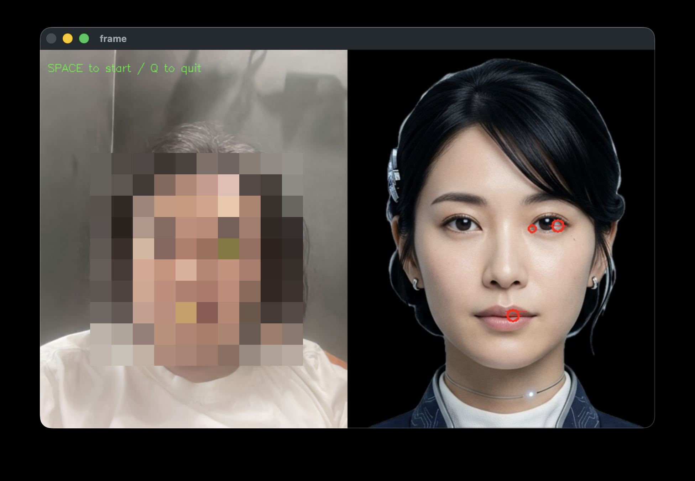

# Zoom Avatar Mac

写真1枚からリアルタイムにアバターを動かして Zoom で使うツール。

Mac (Apple Silicon) + ailia SDK + LivePortrait + pyvirtualcam で構成。



## 必要環境

- macOS (Apple Silicon M1/M2/M3/M4)
- Python 3.11 以上
- OBS Studio（仮想カメラドライバとして使用。アプリの起動は不要）

## セットアップ

```bash
git clone https://github.com/ryun818/zoom-avatar-mac.git
cd zoom-avatar-mac
bash setup.sh
```

### OBS 仮想カメラの準備（初回のみ）

```bash
brew install --cask obs
```

1. OBS を起動
2. 「仮想カメラ開始」→「仮想カメラ停止」→ OBS を閉じる
3. システム設定 → 一般 → ログイン項目と拡張機能 → カメラ拡張機能 → OBS を許可

## 使い方

```bash
source venv/bin/activate
python live_portrait.py -i <写真ファイル>
```

### 操作

1. プレビューウィンドウが開く（左: Webカメラ、右: 元画像）
2. 黄色マーカーで顔のトラッキング位置を確認
3. **スペースキー** で開始
4. 左: Webカメラ、右: アバター出力
5. 仮想カメラ（OBS Virtual Camera）に自動出力
6. **Q キー** で終了

### Zoom で使う

Zoom → 設定 → ビデオ → カメラ → **OBS Virtual Camera** を選択

## オプション

| オプション | デフォルト | 説明 |
|---|---|---|
| `-i`, `--input` | `avatar.jpg` | 元画像（アバターの顔） |
| `--driving` | `0` | Webカメラ番号 (0=内蔵) or 動画ファイル |

## アーキテクチャ

```
Webカメラ → live_portrait.py (ailia SDK / MPS GPU)
              ├→ pyvirtualcam → OBS Virtual Camera → Zoom
              └→ cv2.imshow プレビュー
```

## 注意事項

- 初回実行時にモデルファイル（約680MB）が自動ダウンロードされます
- 正面を向いた顔写真を使うと精度が良くなります
- 透過 PNG は使えません（JPG に変換してください）
- ailia SDK は無償版ライセンスで動作します（詳細: https://ailia.ai/license/）

## ライセンス

- live_portrait.py, utils_crop.py: [ailia-models](https://github.com/axinc-ai/ailia-models) より（改変あり）
- LivePortrait モデル: [LivePortrait](https://github.com/KwaiVGI/LivePortrait) (Apache-2.0 / 非商用制限あり)
